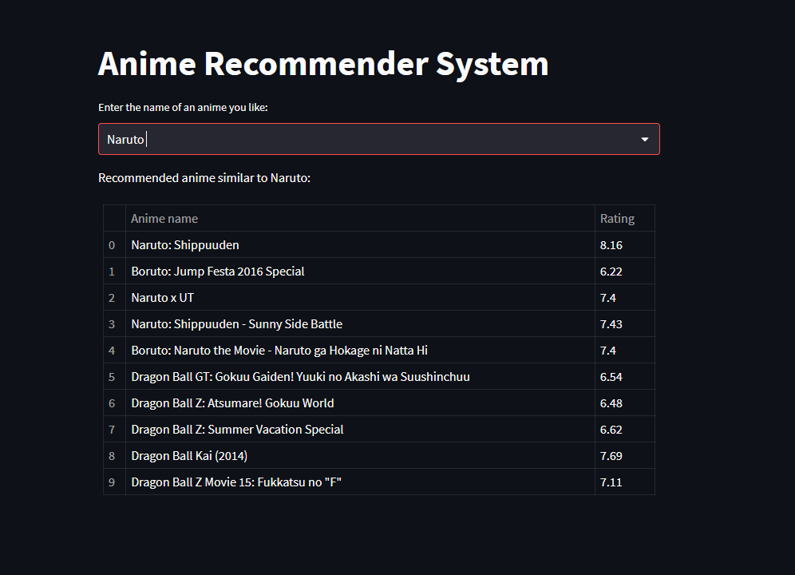

# anime-recommender-system
This repository contains a Python script for an Anime Recommender System. The system suggests similar anime titles based on the input provided by the user.<br>

## Preview


## Dependencies
- scikit-learn (sklearn)
- pandas
- re
- streamlit
- joblib

## Installation
To use this script, follow these steps:
1. Clone this repository:<br>
```git clone https://github.com/your-username/anime-recommender-system.git```
2. Install the required dependencies using pip:<br>
```pip install -r requirements.txt```
3. Run the python script:<br>
```streamlit run anime_recommender.py```

## Generating Required files
Before running the script for the first time, some required files need to be generated. The script will check for the existence of the following files:

- tfv.joblib: Stores the TfidfVectorizer used to transform the genres of anime into a sparse matrix.
- sig.joblib: Stores the similarity matrix (sigmoid kernel) between anime titles.
- indices.joblib: Stores a Pandas Series object where the index is the anime names and the values are the indices in the anime data.

If these files do not exist, the script will generate them by performing the following steps:

- Preprocess the genres column of the anime data.
- Create a TfidfVectorizer object to transform the genres into a sparse matrix.
- Compute the sigmoid kernel using the Tfidf matrix.
- Create an index mapping the anime names to their indices in the anime data.
- Save the generated files for future use.
